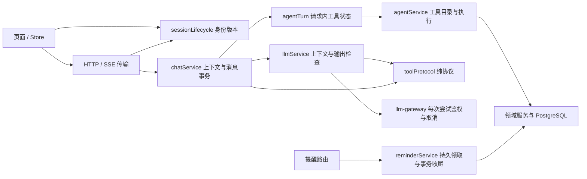

# 第一性原理架构优化与对抗审查

> ✅ 当前有效 · 2026-09-12 · 描述本次工作区实现与验证，不代表公开发布或用户验收。

## 目标与约束

项目提供持久的私人陪伴、用户可控记忆和可执行工具。核心价值来自上下文连续、操作可信和数据归属正确；增加服务数量或抽象层数本身不创造价值。因此保留 React / Express / PostgreSQL 模块化单体，优先修复真实执行边界。没有新增依赖、数据库字段、基础设施或训练任务。

本次以 `cyber-sister` 的当前工作区为起点：检查开始时已有 66 个已跟踪文件的未提交变更及新增界面资产。保留这些工作；未改历史仓库、原始数据、凭据或产品视觉设计。起始提交是 `4f0a606`，不能将相对该提交的全部 diff 都归因于本次。

从目标推导出的不变量：

1. **身份属于请求。** A 身份发起的响应不能进入 B 身份的状态；同一身份内，旧视图读取不能覆盖新操作。
2. **同意属于每次外发。** 布尔快照不能代表之后重试时仍然同意；取消须贯穿预处理与模型调用。
3. **模型文本只是数据。** 前缀长得像工具调用不等于整段回复是执行指令；安全检查必须覆盖实际显示的全部内容。
4. **状态有单一所有者。** JSON 与 SSE 只是传输方式，工具预算、去重结果和强制收尾不能各自实现一套。
5. **副作用必须诚实。** 已尝试失败不能伪报成功；并发请求必须争用数据库状态，进程内标记不足以保护定时任务。
6. **派生数据依附原文。** 语义向量是可重建投影，不能在内容改变后仍代表旧内容。

## 实现后的模块边界

| 原来的耦合 | 本次调整 | 实际收益 |
| --- | --- | --- |
| `llmService → agentService → 数据库/工具/搜索`，只为识别文本前缀 | 抽出不依赖业务模块的 `toolProtocol`，执行层保留兼容导出 | 协议可单独验证；模型输出处理不再导入工具执行依赖 |
| JSON 与 SSE 分别维护轮次、历史、去重与动作摘要 | 请求内 `agentTurn` 统一拥有这些状态 | 两种入口共享三轮工具预算、真实结果回放与第四轮收尾 |
| 各 Store 独立清理，HTTP 与 SSE 各自刷新，迟到请求无身份归属 | 小型 `sessionLifecycle` 统一身份版本与清理；认证操作串行、刷新单飞 | 退出/换账号作废旧结果；工具记录与资产缓存同时清空 |
| `/due` 读取 pending 后直接执行 | `pending → running` 数据库条件领取，再事务收尾与条件推进调度 | 多页面/进程争用时只有领取成功者可执行；旧确认不会倒退新调度 |

`agentTurn` 的状态只活在一次请求内；没有引入通用工作流引擎。`sessionLifecycle` 只表达身份失效与清理，没有扩展为应用事件总线。两个模块分别对齐真实生命周期，从而实现高内聚、低耦合。

## 对抗检查与修复证据

采用三个独立子代理加主代理；修改后交换审查范围，使用合成输入、延迟 Promise、模拟供应商和数据库条件更新构造反例。没有调用真实云端模型或使用用户私密内容。

| 角度 | 攻击或故障场景 | 修复后的保证 / 回归位置 |
| --- | --- | --- |
| 授权 | 第一次 HTTP 失败后撤回同意，第二次尝试继续外发 | 网关每次尝试重新鉴权；`packages/llm-gateway/src/index.test.js` |
| 授权 | 查询向量沿用旧布尔同意值 | 向量请求复核授权并传递取消信号；`embeddingService.test.js` |
| 输出安全 | 前 2000 字正常，第 2001 字后出现被禁内容 | 完整文本先检查，再执行显示长度限制；`llmService.test.js` |
| 隐私 | 分句流直接输出邮箱/手机号，最终消息才脱敏 | 分句与最终文本统一脱敏，必要时 replace 对齐；`llmService.test.js` |
| 协议 | 工具 JSON 后附“这是示例，不要执行”，或完整对象之后断流 | 等完整成功结束后解析整段，拒绝尾随说明/多对象；`toolProtocol.test.js`、`llmService.test.js` |
| 取消 | 预处理期间取消，模型迟到 done/toolcall，或 error 后错误地继续 done | 停止后续阶段、工具执行与消息提交；事务内检查取消并抛错回滚；`chatService.test.js` |
| 取消 | 策略斟酌忽略请求 signal | 非流式模型接口统一转发取消并拒绝迟到结果；`llmService.test.js` |
| 正确性 | 第四次仍输出 toolcall，SSE 安静结束而 JSON 返回兜底 | 两入口共用状态；SSE 也输出 replace + done，不再执行工具；`chatService.test.js` |
| 幂等 | 首次工具失败后模型重复相同调用，被错误报告为成功 | Map 缓存进行中的调用及真实成功/失败结果，重复调用不重落副作用；`agentService.test.js` |
| 幂等 | 同参数换 JSON 键顺序绕过去重 | 参数稳定排序后生成签名；`agentService.test.js` |
| 任务并发 | 两次 `/due` 同时执行同一带副作用任务 | 数据库条件领取；执行失败与结果保存失败分别处理；`reminders.test.js`、`reminderService.test.js` |
| 调度一致性 | 旧投递 ack/完成覆盖已改期或暂停的调度 | 条件推进与投递收尾同事务；running 不允许 ack；`reminderService.test.js` |
| 记忆投影 | 重建对象缺少 userId，被宽松 mock 掩盖 | 明确传入用户 ID，回归使用严格归属检查；`embeddingService.test.js` |
| 记忆投影 | 旧向量请求比新请求晚完成，或编辑后新投影失败 | 按用户与原文条件写回；修改原文时原子清空旧向量；向量/记忆服务测试 |
| 会话隔离 | 退出后列表/创建回填，旧流 finally 解锁新流，同 ID 读取乱序 | 身份、视图和流归属检查；`chatStore.test.js` |
| 认证隔离 | 旧刷新更新新账号 token，旧 401 重放写请求 | 身份版本约束与认证操作串行；`api.interceptors.test.js`、认证服务/Store 测试 |
| 请求发起 | Axios 异步拦截器在微任务切账号后才读取令牌，旧操作发给新账号 | 请求拦截器同步捕获身份；真实 Axios + 本地 adapter 验证发起归属与旧请求零重放；`api.session.test.js` |
| 私有状态 | 换账号后旧经期记录、头像或背景 Promise 回填 | 身份切换清理 Store、作废结果并释放 object URL；工具/外观 Store 测试 |
| 日志隐私 | 子进程错误包含搜索 query，Prisma 错误包含记忆原文 | 仅记录错误代码，不记录原始异常正文；搜索/向量服务测试 |

## 仍需保留的边界与后续优先级

### P1：外部文本不能被视为操作授权

搜索结果仍以模型可见的工具反馈进入后续回路，而注册表包含写入/删除工具。完整协议解析、防重复、关键词过滤并不能证明模型能抵抗提示注入。本次没有给已有工具增加逐操作用户确认界面，也没有声称解决这类语义授权问题。下一阶段应明确“本轮用户允许的操作集合”，由执行层判断；高影响写操作使用独立确认凭据。扩大外部工具或无人值守权限前需完成此项。

### P1：执行不确定与恢复

工具写入与后续模型回复不是同一个数据库事务。工具成功后模型失败，聊天消息可以不保存，但工具效果可能已生效；跨 HTTP 重试也没有持久化的整轮幂等键。不得向用户承诺“重试整轮必定无重复副作用”。

领取后进程崩溃、或工具完成后保存结果失败，会保留 `running`，阻止自动重复执行；当前没有自动恢复租约或人工处理界面。应先核实实际效果再处理这类记录。本次提供了安全停止边界，尚未实现完整恢复产品流程。

### P2：提交与网络不是原子操作

消息事务在开始及内部写入后检查取消；最后一次检查与数据库完成提交之间仍有窗口。数据库提交后客户端断线，服务端无法撤销既成提交，客户端也可能没收到 done。危机干预是明确的独立持久化分支。

现有 `04-开发/API文档.md` 中“任意中途断线完全不落库”的表述过宽，本报告记录此偏差。准确语义是：**已观察到的取消/错误不启动后续操作，事务内观察到取消则回滚；提交后的网络失败通过重新读取会话恢复事实。**

### P2：性能与多窗口

滚动摘要仍查询全部会话消息，摘要异步写回缺少版本竞争控制；历史排序与按时间截断在同时间戳下需要专项验证。隐藏策略斟酌和查询向量还增加每轮外发与延迟。本轮没有用真实供应商测量时延、费用或长历史负载，不能声称提升了吞吐或成本。

浏览器身份版本与认证串行保护作用于单个页面实例；跨标签页共享 Cookie / localStorage 的认证竞争仍需单独设计和浏览器测试。独立的双模块实例模拟已确认：另一标签页登录 B 后，原标签页的身份版本不变，仍可能接收 A 的旧结果，而下一请求使用共享存储中的 B 令牌。当前保证不能扩展为“所有标签页的账号切换均隔离”。关键词规则只是确定性兜底，不是任意有害输出或隐私泄漏的完备判定器。

聊天取消会阻止搜索完成后继续调用模型或执行下一个工具，但搜索子进程/搜索 fetch 本身目前只受其自身超时约束，不会立即跟随聊天取消退出。

## 验证记录

2026-09-12，Node.js 24.15.0、pnpm 11.5.1；工作区当前版本：

| 检查 | 结果 |
| --- | --- |
| 根目录 `pnpm typecheck` | 通过 |
| 根目录 `pnpm lint` | 通过，0 errors；Web 13 / API 81 warnings（主要为复杂度与测试 require-await），未宣称无警告 |
| `pnpm --filter cyber-sister-server test`（含 Prisma generate） | 58 文件、801 测试通过；真实 PostgreSQL 套件 2 测试跳过 |
| 在 `apps/web` 执行 `node node_modules/vitest/vitest.mjs run --no-cache --reporter=dot` | 79 文件、625 测试通过 |
| 在 `packages/llm-gateway` 执行 `node --test` | 17 测试通过 |
| 在 `apps/web` 执行 Vite build，输出至新的临时目录并禁用清空旧目录 | 通过；主包约 350 kB，衣柜懒加载包约 1.08 MB；未把包大小提示当作失败 |
| 本次源码、测试与文档范围的 `git diff --check` | 通过 |

合计 **1443 项测试通过，2 项真实数据库测试跳过**。最后一处 Axios 修复后重新运行了全量 Web 测试、类型检查、目标 Lint 和临时目录构建。没有运行真实 PostgreSQL 并发/隔离/回滚验证、真实供应商提示注入测试、应用浏览器 E2E 或用户使用验收。提醒的并发测试是内存状态与查询条件的模拟，事务测试确认异常传播，不能替代真实数据库实证。另已用内置浏览器检查离线架构图报告的排版。

标准根命令的环境差异必须保留：`pnpm test` 的 Web 用例通过后，向旧 `node_modules/.vite/vitest/results.json` 写缓存遇到 EPERM；上述 `--no-cache` 全量重跑成功。`pnpm build` 清理旧 `apps/web/dist/assets` 遇到 EPERM；改用新临时目录构建成功。没有删除用户旧输出、修改目录权限或更换依赖。全工作区 diff 检查仍报告未参与本次修改的 `apps/web/src/styles/globals.css:441` 原有文件尾空行。

结论：本轮架构优化已落到代码，并完成多角度独立审查与自动回归；P1 的操作授权和跨请求副作用问题仍列为未解决项，不能据此宣称无人值守工具执行已经安全。工作区未提交、未部署，最终行为仍待用户验收。
