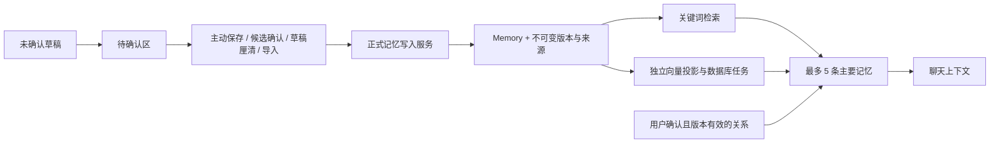

# Amie 记忆系统：确认、版本、投影与迁移

> 状态：当前工作区已实现并完成隔离验收；未切换个人数据库。2026-09-13。
> 范围：Amie 的模块化单体与 PostgreSQL，不引入独立知识数据库或第三方 Agent 授权。

## 1. 唯一权威与模块职责

用户确认的 Memory 是长期记忆的唯一权威。DerivedInsight 是待核对草稿；MemoryProjection 是可丢弃的机器投影。聊天原文与滚动摘要属于会话，不能自动晋升为长期记忆。



| 模块 | 责任 |
|---|---|
| memoryService / memoryGovernance | 正式写入、归属与来源校验、修订、恢复、事务与依赖失效、删除 |
| derivedService / edgeService | 草稿状态转换与关系确认，不绕过正式写入边界 |
| embeddingConfig / embeddingService | 独立配置、授权、向量验证及提交前校验 |
| memoryIndexService | PostgreSQL 任务、修复/重建、进度、取消与重启恢复 |
| memoryTransferService / importService | v2 引用映射、历史恢复、选择确认、幂等去重与整批事务 |
| chatService / llmService | 读取有效正式记忆，融合检索并构造有边界的提示词 |

所有正式创建路径复用 createMemory。领域服务共享按用户行加锁的事务；网络调用在事务之外。数据查询和写入均限定当前用户。数据库约束补充版本唯一键、版本/投影/关系的外键和每用户一个活跃索引任务；结构化来源由服务端验证。

## 2. 正式记忆与历史

- 每次创建、修改、确认、厘清与恢复记录快照；修改和恢复必须提供 expectedRevision。
- 恢复生成新修订，不覆盖旧版本；快照保存正文、类型、重要度、标签、有效期、来源、确认动作与时间。
- 历史基线仅证明迁移时的内容。基线时间是建立基线的时间，不能冒充历史用户确认时间。
- 来源包含对象类型、对象 ID、记忆修订及精确片段。普通来源只能引用本人当前有效记忆或本人用户消息，伪造片段和跨用户引用拒绝。
- 草稿晋升、关联正式记忆、写版本、改变草稿状态在同一事务完成。对同一已处理草稿的等价重试返回原结果；被拒绝或失效的草稿不能直接晋升。无可靠来源的历史草稿只能经明确的手动核对保存。
- 正文或类型改变时，同一事务删除旧投影，将相关有效关系与依赖草稿标为 needs_review，保留之前的确认记录。
- 重要度或标签变化也生成版本；内容未变时可推进仍有效的投影/关系版本引用，无需再次调用模型。
- 永久删除同时清除自身版本、投影、关系和依赖草稿，擦除其他正式记忆及其历史中的来源副本与失效 sourceRef。其他正式正文与原始聊天不随来源一起删除。
- 擦除被删除来源的引用副本是快照不可变规则的隐私删除例外，不能借此改写历史正文。
- memoryEpoch 在正式写入、删除、清空草稿时递增。后台派生提交前重新检查该值和来源版本，避免迟到结果复活资料。
- 清空待确认区只删除 active / dismissed / needs_review 草稿；promoted / resolved 和正式确认历史保留。

## 3. 检索与投影

memory_projections 独立保存向量，绑定 memoryRevision、provider、model、dimensions、ruleVersion。旧 memories.embedding 列仅为增量兼容保留，检索不读取它。

每次查询读取全部有效正式记忆，不再先按重要度截取 200 条。关键词、标签与合格语义候选合并评分；相关性优先，重要度仅用于相关结果排序。最终最多 5 条主要记忆，每条最多 2 个关系上下文。

关系必须为 canonical，且两端修订与当前正式内容一致。相似、相关、冲突保留类型；冲突内容并列呈现，模型不得自动裁定哪条为真。所有记忆被包裹为不可信背景数据，不能作为改变模型规则的指令。

向量配置与聊天模型完全分开，使用 MEMORY_EMBEDDING_BASE_URL / MODEL / DIMENSIONS / API_KEY（支持 API_KEY_FILE）。配置完整不代表已验证在线。模型身份、维度、规则、修订不匹配，以及无效/零向量均不能比较。

索引任务：
- repair：仅补缺失或不匹配的投影；rebuild：全部重新生成。
- 每用户最多一个 queued/running 任务；创建返回 202，不能当作完成。
- 每页 50 条，在单 API 实例内执行；不同用户最多 4 个任务同时运行。
- 新向量验证成功后逐条替换。单条失败保留仍有效的旧投影，继续其余条目。
- 取消更新数据库状态并中止请求；删除也将该用户的活跃索引任务取消，迟到结果提交时再次检查。
- 进程重启把 running 标为 interrupted，queued 可继续。用户可重新发起 repair 或 rebuild；任务不会伪装成完成。
- 进度查询单独按用户限流 120 次/分钟，不消耗普通接口 100 次/15 分钟的额度。其他写操作继续使用普通额度。

当前全库候选在应用内融合排序，向量仍存于 PostgreSQL 普通数组。此实现服务当前 Amie 的资料规模；增加专门向量引擎或多进程任务租约不在本轮范围。

## 4. 生成与聊天边界

| 能力 | 当前行为 |
|---|---|
| 普通/流式聊天 | 沿用已有云端聊天通道，只使用已确认记忆和有效已确认关系 |
| 滚动摘要 | 用于当前会话衔接；区分用户陈述、助手建议和未证实推测，以用户当前陈述为准 |
| 聊天内部沟通策略 | 沿用现有聊天通道，只读取有效正式记忆，不读取未确认草稿 |
| 工作台整理、重建等工作生成 | 固定模拟响应；不读取私人上下文、不写持久化草稿、不请求模型 |
| 历史草稿确认/厘清 | 用户操作触发正式写入，不隐式调用云端或生成向量 |
| 记忆向量 | 独立配置与验证；沿用现有云端同意门。缺配置、拒绝、故障时关键词检索仍工作 |

设置和同意文案明确区分聊天模型、独立向量服务及工作台模拟。未配置向量不阻断保存；向量请求失败不阻断聊天的关键词记忆路径。

## 5. 产品与迁移闭环

统一入口 /memories：
- 已记住：搜索、类型筛选、服务端分页、编辑及删除。
- 待确认：搜索、状态筛选、分页、查看依据、直接确认或编辑核对；模拟预览不添加假草稿。
- 关系：状态筛选与分页、依据版本、确认历史、重新确认或移除。
- 详情：来源、导入身份标记、历史比较、恢复。409 保留尚未保存的输入，明确提示重新核对。

旧 /profile/memories 跳到已记住；旧 /tools/workspace 跳到待确认。沿用夜间主题、移动端控件和页面布局。

v2 导出包含正式内容、版本、来源、确认记录及 canonical / needs_review 关系；机器向量不导出。保留 v1 导出中其他业务数据段，但其他业务的导入范围仍限原有角色、人设和显式记忆，不把聊天、日记等自动导入。

导入采用预览 → 逐项选择 → 应用：
- 包内稳定 ID 映射到当前账户的新对象，不把外部 ID 当成本地访问权限。
- 版本必须完整连续、与当前内容及来源一致。内容/历史不同的既有对象报告冲突，不覆盖。
- 重复导入同一内容跳过；关系需要同时选择两端，依据引用限两端记忆的版本。
- 已定位的记忆来源重映射；无法定位的聊天来源显示缺失。导入历史标为 imported，本次用户确认导入时间另存，不能伪装本地原生确认。
- 新界面携带预览返回的 memoryEpoch。导入记忆必须提供 expectedMemoryEpoch；资料变化后旧预览返回 409，防止删除后重试旧导入请求复活数据。重新预览后仍可以明确从导出包恢复。
- 重复的旧预览请求可能返回 409；重新预览显示重复并跳过，不会重复创建。整批包括角色和人格更新都在事务内，任何失败均回滚。
- 不导入云端授权，不导入并自动确认 AI 草稿。

接口字段和示例见 [记忆系统接口](../04-开发/记忆系统接口-20260913.md)。

## 6. 增量迁移与恢复演练

迁移文件：
1. 20260913120000_memory_governance：保留 ID/正文，建立首个基线版本、独立投影和索引任务。
2. 20260913121000_memory_import_provenance：资料世代号与导入历史标记。

旧投影缺完整供应商和维度等元数据，不复制到有效投影表。第一次 repair 才生成可验证的新投影。

此次发现原本机数据库容器与数据卷不在，未把任何个人数据库重置为测试库。使用 PostgreSQL 16.6 的隔离实例（127.0.0.1:55432）完成：
- 恢复 2026-09-12 19:15 的现有备份到独立恢复库，然后应用增量迁移。备份中 8 条聊天消息，0 条记忆。
- 在另一备份克隆中加入一条明确的合成旧记忆和旧向量，迁移后 ID、正文、首个修订、基线动作、快照内容及未知来源检查全部通过；有效新投影为 0，消息仍为 8。
- 原备份仅被读取，未覆盖。恢复库与迁移探针仅用于恢复验证，网站验收使用另一合成账户数据库。
- 个人网站使用备份还是另一处现存数据库，仍等待用户此前问题的答复；此文不表示已经恢复或切换个人数据。

实际升级已有库时先停止写入与后台任务，制作数据库备份并恢复到新克隆验证，核对迁移前后 ID/正文/消息与版本计数，再按部署手册执行 migrate deploy。失败时保留原库，恢复备份到新数据库并核对后切换；不使用 reset，也不尝试让旧程序继续写入已升级库。

## 7. 对抗性审查与验收记录

| 角度 | 核验边界与结果 |
|---|---|
| 权限与确认 | 跨用户来源、伪造片段、拒绝后强行晋升、跳过重审拒绝；普通/流式提示词与模拟工作生成不读取草稿 |
| 原子性与并发 | 同版本双写仅一次成功；晋升重复请求不重复创建；数据库触发器注入失败后正式内容与导入角色均回滚 |
| 失效与删除 | 修改触发关系重审，恢复追加版本；删除清除引用副本，迟到向量及关系生成不能复活；过期导入预览拒绝 |
| 语义检索 | 第 201 条之后相关内容被召回；旧修订、混合模型与错误维度排除；投影故障保留关键词路径 |
| 任务韧性 | 重复任务去重、取消与服务重启可识别；有效投影不被失败覆盖，修复跳过有效项并继续失败后的条目 |
| 可迁移性 | v2 内容/版本/关系/关系依据往返一致；重复、冲突、缺失来源、v1 包明确处理；不恢复授权 |
| 产品与时序 | 浏览器完整确认、编辑、重审、恢复、删除、索引与导入流程；修复轮询抢占额度及迟到初始状态覆盖新任务的问题 |

真实浏览器使用隔离的合成账户和本地向量替身，无外部模型调用：
- 保存新记忆、确认有来源的草稿、编辑记忆触发关系重审、重新确认关系、恢复 v1 成为 v3 并再次重审。
- 索引重建完成 4/4，随后单独启动并取消另一任务；删除合成记忆后列表正确更新。
- 导入空账户得到 3 条记忆、1 条待重审关系，v3 历史完整；重复导入跳过 3 条，不恢复云端同意。
- 原工作台路由跳转到待确认页；模拟整理不产生草稿。
- 导出按钮完成响应；下载链接挂入文档且延迟释放后，内置浏览器仍未返回 download 事件，默认下载目录也未找到本次文件。补验 Chrome 时自动化连接不可用，因此不宣称下载已落盘。界面改为「已发起下载，请在浏览器下载记录中确认」，服务端导出内容及导入恢复已通过独立测试。
- 检查夜间模式和 393×852 移动端，没有横向溢出；结束时恢复跟随系统及默认视口。

可复现自动检查：
```powershell
# TEST_DATABASE_URL 必须指向隔离 PostgreSQL 管理连接。
pnpm --filter cyber-sister-server test:postgres
pnpm --filter cyber-sister-server test
pnpm --filter cyber-sister-client test
pnpm --filter @cyber-sister/llm-gateway test
pnpm typecheck
pnpm lint
pnpm --filter cyber-sister-client build
```

PostgreSQL 测试会创建自有唯一测试库、应用全部迁移，结束时只删除自己创建的库。单元测试阻止未替换的 API 请求访问正在运行的开发服务器。

2026-09-13 最终自动检查：API 889/889（含 20 项记忆 PostgreSQL 测试及 3 项既有 PostgreSQL 测试），Web 699/699，网关 17/17，共 1605 项通过，0 失败、0 跳过；类型检查、静态检查与生产构建通过。构建输出使用工作区外独立目录，未覆盖此前构建产物。

原始记录位于本机工作区的 asset-work：memory-api-complete.json、memory-web-complete.json、memory-gateway-verified.txt、memory-typecheck-complete.txt、memory-lint-complete.txt、memory-build-complete.txt；早期失败报告保留作审查证据。静态检查允许的复杂度等警告与既有 3D 衣柜构建分包警告不等于失败，也未以无关重构消除它们。Windows 换行按 cr-at-eol 检查，差异无新增空白错误。
