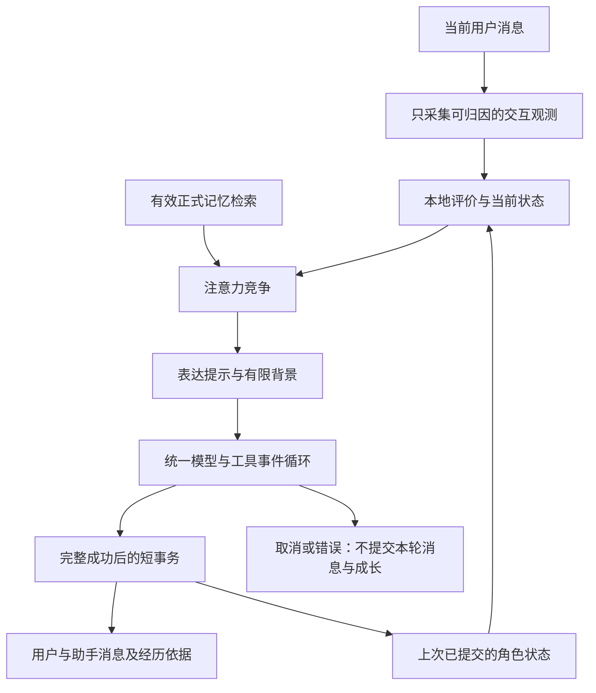

# Pi 运行循环与角色持续成长

状态：✅ 当前有效 · 2026-09-15（源码实现；数据库迁移尚未应用到个人环境）

## 任务解释与取舍

用户要求理解手写算法图及 `earendil-works/pi`，据此重构当前项目，并明确选择建模 **AI 角色自身的持续状态与成长**。主项目为 `cyber-sister`。工作基于当时包含大量未提交成果的工作区，保留聊天授权、正式记忆治理、身体与情绪技能、工作模式及界面改动。

图片是十项概念模型。乘法、加权竞争和增量学习可以直接计算；冷热、回避、封存的 `f(...)` 没有具体函数、量纲和参数。以下补充是本产品的可测试模拟规则，不是经标定的生理或心理定律。身体刺激也不从用户说“我疼”自动转给角色。

考虑过三种实现：只加提示词无法保证跨轮状态与回放；整体引入 pi 的模型/存储栈会引入第二套供应商与会话管理；本次采用现有网关、Prisma 与两个真实模型适配器，共用精简事件循环和独立数值模块。没有新增 npm 依赖，也没有复制 pi 源码。

## Pi 源码依据

核对的提交为 `53816d7dcc5ebe3a0eedec3cd07196c3a66d83fd`。研究副本位于仓库外 `asset-work/pi`。

| 原始实现 | 借鉴内容 | Amie 的实现 |
| --- | --- | --- |
| [agent-loop.ts](https://github.com/earendil-works/pi/blob/53816d7dcc5ebe3a0eedec3cd07196c3a66d83fd/packages/agent/src/agent-loop.ts) | 一个循环推进模型、完整消息、工具结果；错误/取消终结当前运行 | `agentTurn.js` 的 `runAgentLoop`；普通与流式接口各提供一个事件适配器 |
| [agent README 的 Message Flow](https://github.com/earendil-works/pi/blob/53816d7dcc5ebe3a0eedec3cd07196c3a66d83fd/packages/agent/README.md) | Agent 内部消息与模型消息分开，调用边界做转换 | 角色数值状态/经历保留在应用层，仅生成受控的表达提示；工具历史在模型调用边界转换 |
| [runtime/reducer.ts](https://github.com/earendil-works/pi/blob/53816d7dcc5ebe3a0eedec3cd07196c3a66d83fd/packages/agent/src/harness/runtime/reducer.ts) | 从事件更新快照，区分运行过程与已完成状态 | `advanceCompanionState(previous, observation, now)` 可重放；持久化只采纳成功完成的回合 |

Amie 继续使用原有工具目录、严格完整 JSON 协议、同一轮签名去重和最多三次工具执行。没有启用编码工具、文件/进程执行、插件热加载或 pi 的其他运行设施。现有工作云和定时任务的未接入门保持有效。

## 数据流

`companionState.js` 只计算；`companionService.js` 负责观测装配和角色存储；`chatService.js` 负责会话归属、授权与聊天提交；`llmService.js` 保留协议、输出过滤、内置技能和供应商适配。各模块通过小接口连接，不建立第二个总控框架。

## 十项算法的具体映射

除温度和时间外，观测强度归一化到 `[0,1]`，非法/非有限数值拒绝。缺省为无此项证据；数值结果有界。`now` 显式传入，系统时钟回退不会倒退状态时间。

| 图中概念 | 当前计算与边界 |
| --- | --- |
| 整体体验闭环 | Observation → Appraisal → State/Attention → 完成后存经历 → 增量学习 → 下次评价与表达 |
| `pain = S × I × C` | `C = 1 + fatigue + injury`；敏感度来自角色固定参数，结果截断至 `[0,1]` |
| 冷热感受 | 采用环境/体温相对基准的偏离，冷感受活动和疲劳修正，热感受活动和缺水修正；必须同时有环境与体温观测。基准/系数是模拟值 |
| 激活与识海 | 权重依次为显著性 `.35`、身体需求 `.20`、情绪 `.20`、目标 `.15`、记忆线索 `.10`；`A > .4`，最多 3 项。当前用户消息保留，剩余预算竞争身体需求和已相关的记忆 |
| 失望 | `expectation × importance × max(0, expectation - outcome)`；正向误差不产生失望，无结果证据也不填补结果 |
| 信任更新 | `.04 × positive + .03 × consistency - .10 × violation - .10 × boundaryViolation`；时间经过不扣信任，工具失败不算用户违约 |
| 回避 | `.35 × threat + .25 × overload + .25 × controlLoss + .15 × expectedCost`；综合积累负荷决定自然/放慢/简短交流 |
| 伤害影响 | `max(pain, disappointment) × helplessness × controlLoss × duration`，加上衰减后的既有影响；此处引入失望是产品补充 |
| 封存 | 威胁、疼痛、无助、失控、反复边界侵犯、逃离失败、恢复失败均超过 `.6`，且威胁/侵犯连续至少 3 次；合取条件不会被其他高分补偿。始终可恢复 |
| 学习更新 | `M ← M + .08 × (evidence - M)`；只凭明确表达偏好和真实工具结果调整表达长度、执行结果预期。一次更新幅度小，多次一致证据才形成稳定倾向 |

瞬态疲劳/负荷随空闲恢复；每次观测最多折算一小时的恢复。显式恢复清除瞬态压力，保留角色参数、信任、学习结果、经历数和正式记忆。表达长度趋势用于下一次提示，执行效果预期影响谨慎表达和后续预测误差；信任仅影响熟悉程度的表达。

**当前真实接入的观测**：消息到达、消息长度形成的模拟工作负荷、完整独立的感谢表达、明确“简短一点/详细一点”等表达偏好、工具真实成败、时间间隔和用户显式恢复。解析为有限规则，不声称完整自然语言理解。

**身体传感器/持续威胁等输入**：数值接口与演算测试已实现；当前产品没有传感器数据源，因此不会因普通情绪倾诉自动触发角色痛觉或封存。`belief`、`Deep Pattern` 尚未建立自动事实库；当前成长是数值模型参数学习。

## 持久化与并发

- `users.companion_state`：角色状态 JSON，含版本、固定参数、身体/感受、信任、防御、注意力、学习及恢复 epoch。
- `users.companion_revision`：每次采纳经历或显式恢复递增。
- `messages.companion_experience`：记录所基于的版本、实际提交版本、有限数值观测、评价结果；不保存额外的原文副本。
- 正式 `Memory` 仍由用户确认。角色经历不自动写入正式记忆，也不读取未确认的理解草稿。

模型生成在事务外。成功后，在原聊天事务内锁定当前用户行，重读最新角色状态，重新应用本次观测，再写入用户与助手消息。并发会话即使基于同一个旧快照生成，提交时也合并到最新状态，不做丢更新的快照覆盖。所有网络调用均在此锁外。

显式恢复递增 `recoveryEpoch`。恢复之前已经生成中的回复可正常保存消息/工具动作记录，但其角色状态更新标为 `superseded`，不把旧压力带回来，也不因状态冲突引导用户重复已执行的工具。恢复操作本身使用 `expectedRevision`，旧版本返回 409。取消或消息保存失败回滚整个聊天事务。

工具副作用仍使用已有工具服务的事务，不与聊天消息事务组成分布式事务；已执行的工具不能因之后模型失败而自动回滚。这一已有边界继续保留，当前去重范围仍是一次回合内。

## 可见功能与接口

设置页新增“她的状态”，显示交流节奏、已纳入经历、表达倾向与学习依据。“恢复平稳节奏”只恢复瞬态状态。

| API | 行为 |
| --- | --- |
| `GET /api/user/companion` | 返回 `{ revision, state }`；无已保存状态时只返回初始值，不写库；按认证用户隔离，禁止缓存 |
| `POST /api/user/companion/recover` | 请求 `{ expectedRevision }`；保留身份与成长；旧版本返回 `409 COMPANION_CONFLICT` |
| `GET /api/user/export` | 原导出包增加独立 `companion` 节及消息经历字段；当前导入流程仍只处理已有可选的人设/记忆候选，不将成长 JSON 导入为用户事实 |

## 性能与上下文修正

每轮不再额外调用云端“策略参谋”。普通无工具聊天的前台生成从一次策略调用加一次回复调用，变为一次回复调用；嵌入检索与达到阈值后的后台摘要维持既有行为。没有用计数变化冒充实际延迟或费用测量。

记忆检索在聊天装配时完成，注意力最多保留两个主记忆线索；模型适配器通过 `memoriesSelected` 使用已选结果，避免每个工具轮重复检索，以及丢失已经剥离投影的纯语义命中。canonical 一跳关系依旧沿用已有校验和预算。

工具续轮保持“原用户请求 → 助手工具调用 → 工具反馈”的时序，`promptInHistory` 防止模型转换时再把原请求追加到末尾。图片仍属于原用户消息，不覆盖工具反馈，包括只发图而没有文本的回合。

## 验证与运行条件

工作区修改前 API 基线：895 项通过，23 项 PostgreSQL 测试因未配置隔离连接跳过。完整测试结果及本轮 patch 存在仓库外 `asset-work/pi-companion-20260915/`，最终数量见该目录 `verification.json`。

测试覆盖：数值关系、封存条件逐项缺失、恢复可逆、输入不变、数值有限性、时钟回退、学习积累、背景预算、用户隔离、恢复版本、在途状态失效、JSON/SSE 一致、取消/迟到/失败终态、语义记忆保留、工具消息顺序和图片回喂。

新增 PostgreSQL 集成测试覆盖实际行锁并发、角色与消息事务回滚、取消回滚、恢复 epoch、用户隔离及账户删除级联。运行方式沿用现有 `TEST_DATABASE_URL` 随机空库机制：`pnpm --filter cyber-sister-server test:postgres`。初次重构时 Docker 不可用；2026-09-15 后续本地联调中，Docker 已恢复，三组真实 PostgreSQL 测试 **29 项全部通过、无跳过**。两处故障注入测试显式保留 Prisma 事务对象的 `$queryRaw` 方法，确保测试真正执行到消息失败与取消后的事务回滚。结果保存在仓库外 `asset-work/local-debug-20260915/postgres-tests.json`。验证使用独立容器和随机测试库，个人数据库未修改。

本地调试库已完成全部 25 个迁移。通过 Vite 的 `/api` 代理验证了健康检查、登录与令牌续期、角色状态保存、旧版本恢复请求返回 409。初次启动缺少云端配置时返回 `503 LLM_UNAVAILABLE`；随后恢复旧启动脚本中的 `dots3-note-prev` 配置，模型最小请求返回 HTTP 200 和 `OK`，应用在用户尚未同意时返回 `503 CLOUD_NOT_CONSENTED`。接口结果见同目录 `http-smoke.json`，模型探测结果见 `dots-check.json`。这些结果不代表已完成浏览器完整聊天流程或长期角色表现验收。

Prisma 客户端生成和本地测试可独立完成；运行更新后的后端需要先对目标环境执行现有 `prisma migrate deploy` 流程，应用 `20260915000000_companion_state`。迁移仅新增两列用户状态字段及一列消息经历字段。本轮不包含部署。

内置浏览器使用真实前端组件、合成状态和隔离接口验证了状态显示与恢复后学习保留，核对了页面样式。该验证不代替真实数据库联调，也不是实际模型的角色表现或长期成长效果验收。
